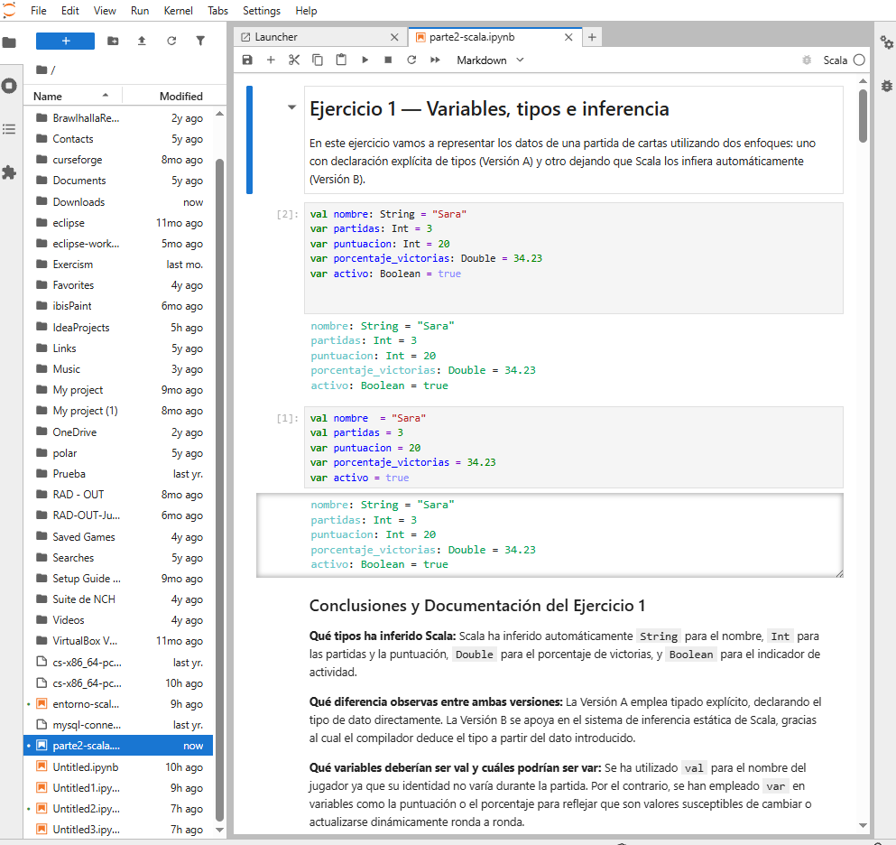
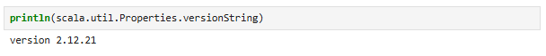
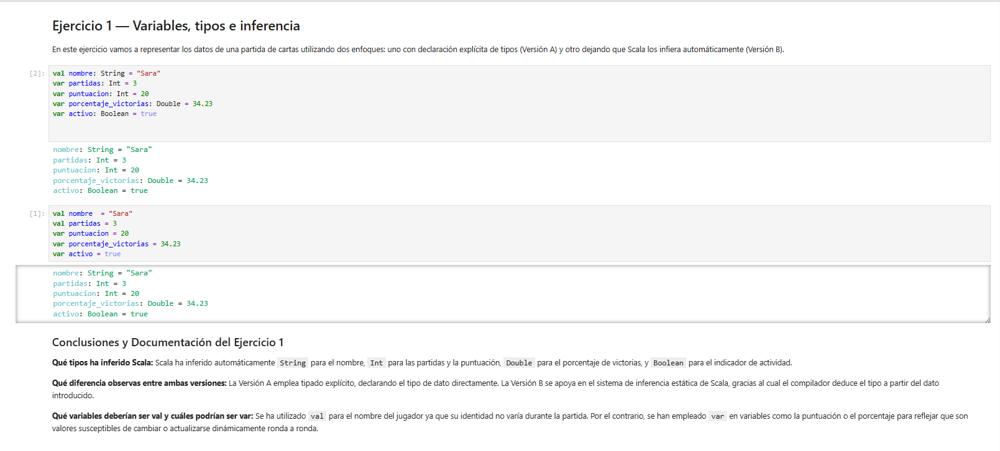
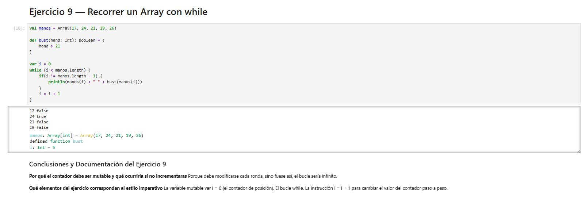
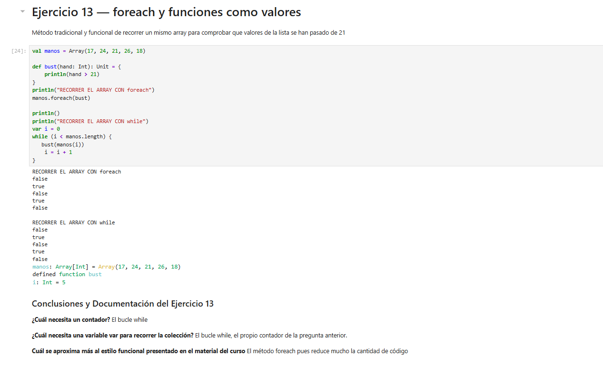
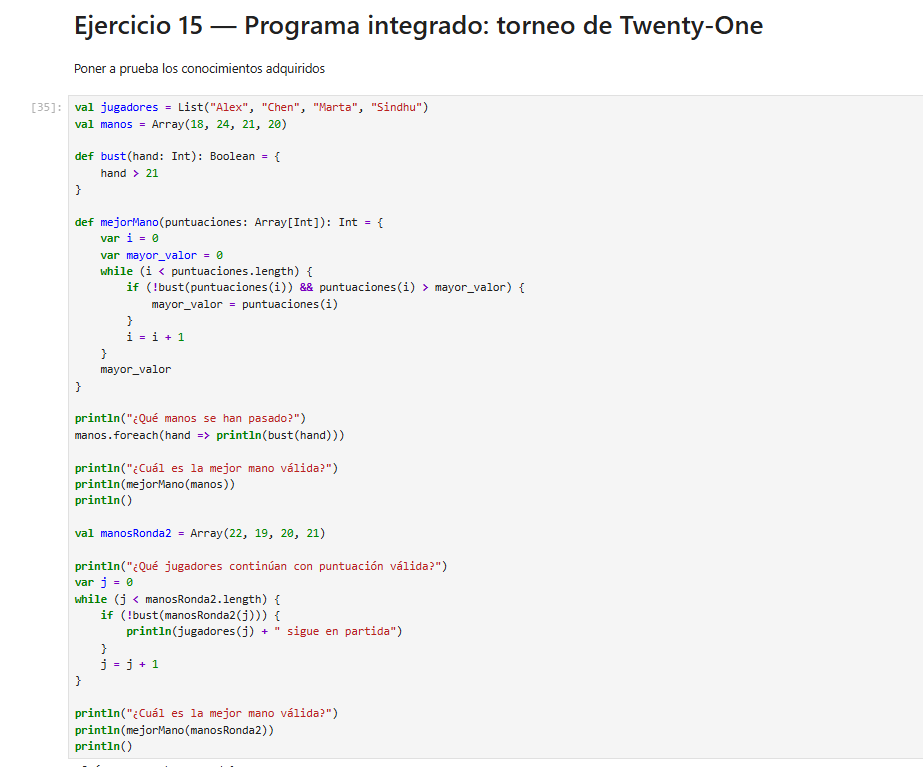
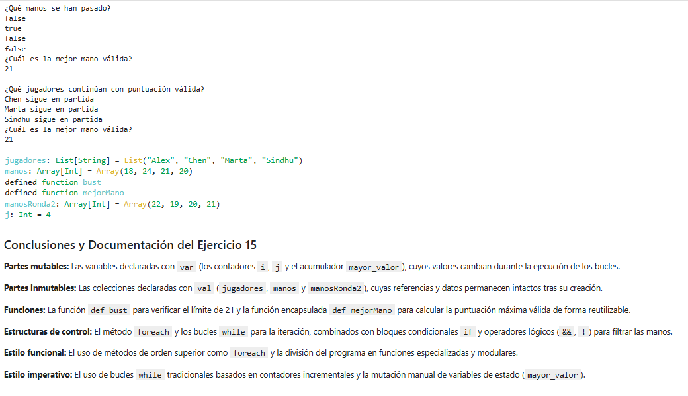

# Parte 2 — Programación con Scala

## Entorno utilizado
* JupyterLab
* Almond Kernel
* Scala 2.12.21

## Contenido
Esta parte contiene 15 ejercicios de programación realizados en Scala utilizando JupyterLab.

## Notebook
* [Ver Notebook de la Parte 2](parte2-scala.ipynb)

## Evidencias

