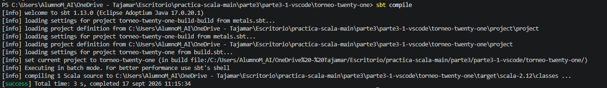
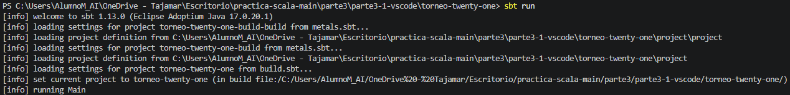
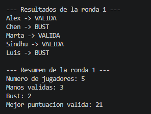
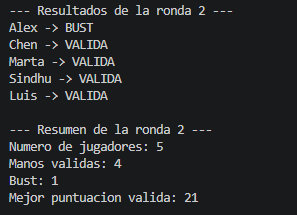
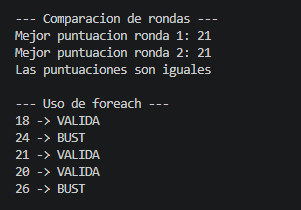
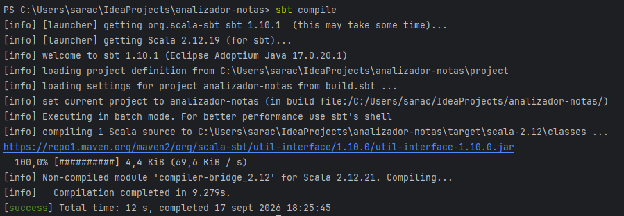
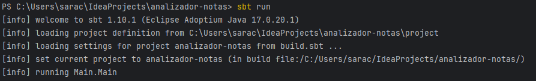
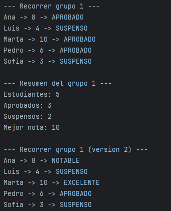
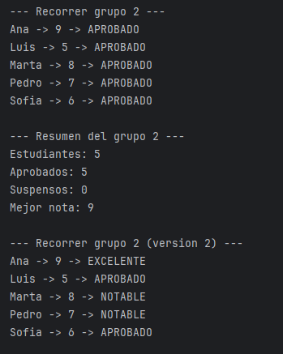
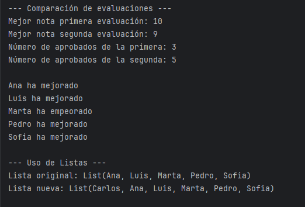

# Mini proyecto 3.1 — Torneo de Twenty-One

## Entorno

- Visual Studio Code
- Metals
- Scala 2.12.21
- JDK 17
- sbt

## Descripción

Pequeña aplicación en Scala que analiza los resultados de varias manos de un torneo de Twenty-One. El programa evalúa las puntuaciones de los jugadores en dos rondas para determinar quién se ha pasado de 21, contabilizar las manos válidas, buscar la mejor puntuación de cada ronda y compararlas al final. Además, hace uso de colecciones (`List` y `Array`) y distintas estructuras de control.

## Estructura

Los archivos principales del proyecto son:
- `build.sbt`: Archivo de configuración de sbt que define el nombre del proyecto y la versión exacta de Scala (2.12.21).
- `src/main/scala/Main.scala`: Archivo de código fuente principal que contiene las variables, colecciones, funciones y la lógica de ejecución del torneo.

## Funciones utilizadas

- `bust`: Recibe una puntuación y devuelve `true` si es mayor a 21, o `false` en caso contrario.
- `estadoMano`: Recibe una puntuación y devuelve el texto "BUST" o "VALIDA".
- `mejorMano`: Recibe dos puntuaciones y devuelve la mayor válida (o 0 si ambas superan 21).

## Colecciones y bucles (while vs foreach)

Se han utilizado `List` para los nombres inmutables y `Array` para las puntuaciones. Al comparar las iteraciones:
- El bucle `while` necesita definir un contador y una variable mutable (`var i = 0`) para controlar el final de la colección.
- El método `foreach` no necesita contadores ni variables mutables externas. Por ello, el `foreach` se aproxima mucho más al estilo funcional presentado en el material del curso.

## Problemas y soluciones durante el desarrollo

- **Problema:** Al usar `sbt run`, la terminal devolvía el error `No main class detected` y no compilaba nada.
- **Solución:** Se corrigió la ubicación del archivo `Main.scala`, moviéndolo a la ruta estricta `src/main/scala/`, y asegurándose de guardar los cambios en VS Code para que sbt pudiera detectarlo.

## Ejecución

```bash
sbt compile
sbt run
```

## Capturas







# Parte 3.2 — IntelliJ IDEA + sbt

## Entorno
* **IDE:** IntelliJ IDEA Community
* **Plugins:** Plugin de Scala
* **Lenguaje:** Scala 2.12.21
* **JDK:** 17
* **Herramienta de construcción:** sbt

## Descripción
Pequeña aplicación en Scala orientada a analizar el rendimiento académico de un grupo de estudiantes a lo largo de dos evaluaciones.

## Estructura
Los archivos principales del proyecto son:

* `build.sbt`: Archivo de configuración global de sbt que define el nombre del proyecto (`analizador-notas`) y la versión exacta de Scala (`2.12.21`).
* `src/main/scala/Main.scala`: Archivo principal que encapsula los datos, las funciones modulares y la lógica de ejecución del análisis.

## Funciones utilizadas
* `aprobado`: Recibe una nota y devuelve un booleano (`true` si es mayor o igual que 5, `false` en caso contrario).
* `estadoNota`: Evalúa la nota y devuelve el texto `"APROBADO"` o `"SUSPENSO"`.
* `maxNota`: Compara dos notas y devuelve la mayor de ellas.
* `clasificacion`: Aplica una estructura condicional anidada (`if`, `else if`, `else`) para etiquetar el rendimiento en cuatro niveles: `EXCELENTE`, `NOTABLE`, `APROBADO` y `SUSPENSO`.
* Funciones modulares auxiliares de procesamiento (`ejecutarListado`, `obtenerMejorNota`, `obtenerNumeroAprobados`, `obtenerNumeroSuspensos`, `ejecutarClasificacion` y `mejorar`).

## Colecciones e Inmutabilidad
* Se ha utilizado una `List` para almacenar los nombres de los estudiantes.
* Se han utilizado arrays (`Array`) para gestionar las calificaciones numéricas de ambas evaluaciones.

## Capturas





